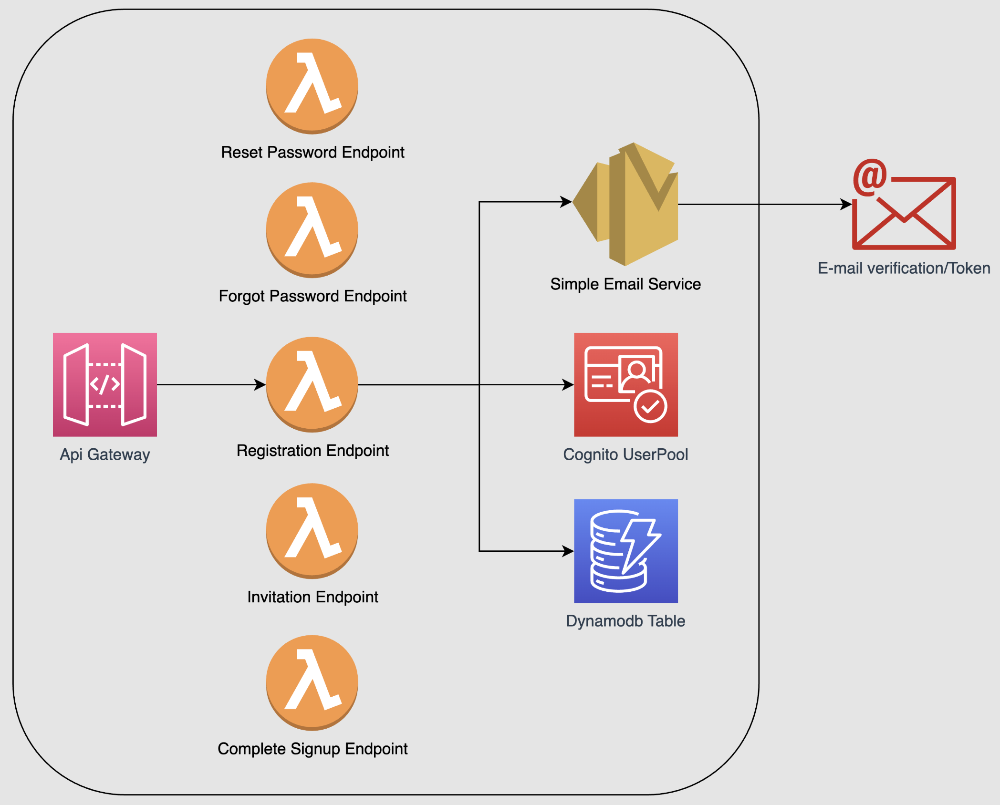

# SaaS Onboarding Project

This is a module for onboarding tenant & users.

## Architecture


## Features

### Tenant Management
* Register Tenant - [`PUT /tenant/registration`](./src/handler/tenant/register-tenant.ts)
* Update Tenant - [`POST /admin/tenant`](./src/handler/tenant/update-tenant.ts)
* Delete Tenant - [`DELETE /admin/tenant`](./src/handler/tenant/delete-tenant.ts)
* Load Tenant - [`GET /admin/tenant`](./src/handler/tenant/load-tenant.ts)

### User Management
* Complete Signup - [`PUT /signup`](./src/handler/user/complete-signup.ts)
* Update User - [`POST /admin/user`](./src/handler/user/update-user.ts)
* Delete User - [`DELETE /admin/user`](./src/handler/user/delete-user.ts)
* Load User - [`GET /admin/user/:id`](./src/handler/user/load-user.ts)
* Load Me - [`GET /me`](./src/handler/user/me.ts)
* List Users - [`GET /admin/users`](./src/handler/user/list-users.ts)
* Forgot Password - [`POST /forgot-password`](./src/handler/auth/forgot-password.ts)
* Reset Password - [`POST /reset-password`](./src/handler/auth/reset-password.ts)

### Invitation
* Send Invitation - [`PUT /admin/invitation`](./src/handler/invitation/send-invitation.ts)

### UI
This repository contains an simple example of an onboarding website consuming the backend.

* Login
* Sign-up
* Reset/Forgot password

Not contains:
* Sign-out or any operation to clear session, or refresh token;

## Useful commands

* `npm run build`   compile typescript to js
* `npm run watch`   watch for changes and compile
* `npm run test`    perform the jest unit tests
* `cdk deploy`      deploy this stack to your default AWS account/region
* `cdk diff`        compare deployed stack with current state
* `cdk synth`       emits the synthesized CloudFormation template

The `cdk.json` file tells the CDK Toolkit how to execute your app.

## Local Setup

1) `yarn` to install dependencies
2) get it done localstack setup section
3) `yarn test -u -w 6` to test updating the snapshots and using 6 workers

### Localstack setup

```
1.1) Install:
pip3 install localstack
pip3 install awscli-local

1.2) AWS Configure:
aws configure --profile test #or whatever profile name

1.3) Start localstack:
localstack start -d

alias awslocal="AWS_ACCESS_KEY_ID=test AWS_SECRET_ACCESS_KEY=test AWS_DEFAULT_REGION=${DEFAULT_REGION:-$AWS_DEFAULT_REGION} aws --endpoint-url=http://${LOCALSTACK_HOST:-localhost}:4566"

2) References:

- https://github.com/localstack
- https://github.com/localstack/awscli-local

3) Verify some e-mail address: 

awslocal --region us-east-1 ses verify-email-identity --email-address sender@mailfrom.com
```

## Roadmap

* Userpool user gropus per tenant & add custom user properties

## Manual resource creation

* Hosted zone
* ACM certificate
* SES config set